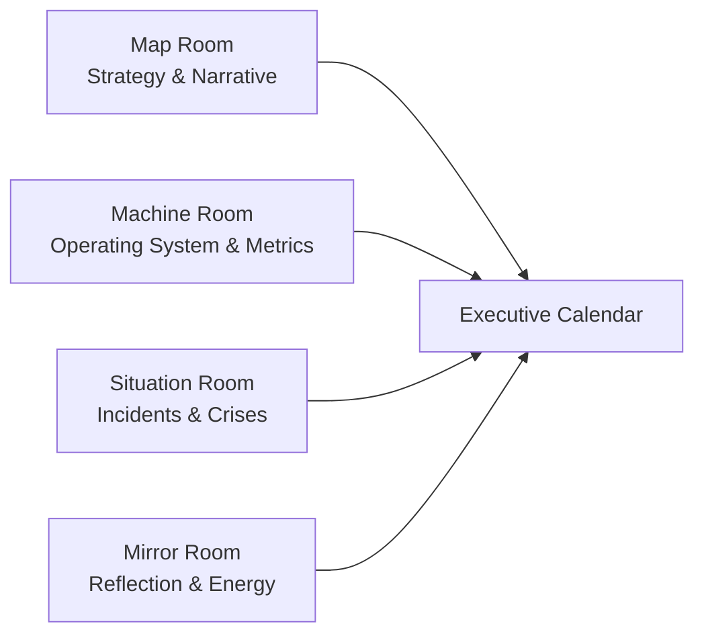

# Chapter 01: The Executive Shift

## Why This Chapter Matters
Your personal shift sets the entire system. Without rebalancing your time, redefining decision rights, and installing core rituals, everything else in this book will underperform. This chapter gives you the executive context and rhythms that make later chapters (strategy, capital, metrics) actually work in practice.

## What Goes Wrong Without This
- Escalation overload: Type 2 decisions keep bouncing up, slowing everything.
- Calendar drift: Meetings accumulate without a decision purpose; prep time explodes.
- Silent misalignment: Teams make reasonable but conflicting choices without context.
- Talent under-leverage: Your best people spend cycles chasing clarity instead of outcomes.

## What Changes at 301
At this level, your role shifts from being the person who solves hard problems to being the person who shapes the conditions in which the entire enterprise solves problems. Your core responsibilities become allocating attention — the rarest and most valuable resource; setting context so decisions can be made without you in the room; selecting people and designing systems that endure beyond individual projects; and stewarding capital — not just money, but also time, brand, and technical leverage.

## Five Executive Levers
As an executive, you wield five key levers to drive the organization forward:
1. **People** — Determining who gets the hardest problems and who is coached, promoted, or replaced.
2. **Strategy** — Making the few decisive bets and explicitly deciding what you will not do.
3. **Narrative** — Crafting a coherent story that aligns thousands of micro-decisions.
4. **Systems** — Establishing cadence, metrics, and clear decision rights.
5. **Capital** — Managing budgets, headcount, time, technical debt, and reputation.

## The Time Portfolio (Default)
To manage your time effectively, consider this default allocation:
- **60% Enterprise-shaping**: Focus on strategy, market/customer insight, capital allocation, and top-talent moves.
- **30% Operating rhythm**: Handle WBR/MBR, unblockers, and cross-functional coordination.
- **10% Maker/learning**: Engage in deep dives, strategic thinking, and writing to clarify thought.

*Tip*: In early-stage or turnaround situations, you may need to invert the 60/30 split—just make the choice deliberately.

## The Four Rooms (Mental Model)
To maintain balance, think of your role through the lens of four mental "rooms":
- **Map Room** — Strategy and narrative (future focus).
- **Machine Room** — Operating system, numbers, and performance (present focus).
- **Situation Room** — Acute response to incidents, PR, outages, and crises.
- **Mirror Room** — Reflection on self-inspection, ethics, and energy management.

Healthy executives schedule time in each room weekly.

### Four Rooms — Visual

## Decision Rights That Scale You
- Define **one‑way vs. two‑way doors** and who decides each.
- Use **RAPID** roles so “recommend/agree/perform/input/decide” and the **DRI** are explicit. (See Chapter 6 for DARCI mapping.)
- Establish **kill criteria** for projects at the moment they are approved.

## Core Rituals to Install
- **Weekly Business Review (WBR)** — 60–90 mins, same data cuts, same owners.
- **Monthly Business Review (MBR)** — Bet reviews, portfolio adjustments, risk review.
- **Quarterly Strategy Review** — Test thesis, markets, and moat; prune roadmap.
- **Talent Friday** (bi‑weekly) — Succession planning, recruiting pipeline, top talent focus.

---

## Deliverables (This Week)
1. **1‑Page Executive Charter** — Your scope, bets, and 90‑day outcomes.
2. **Decision Rights Map** — What you decide vs. delegate (RAPID with DRI).
3. **Operating Cadence** — Your calendar becomes the company’s heartbeat.

### Executive Charter Template

See [Executive Charter Template](./templates/executive_charter.md)

### Decision Rights Map Template (RAPID)

See [Decision Rights Map](./templates/decision_rights_map.md)

### Operating Cadence Template (90 days)

See [Operating Cadence Template](./templates/operating_cadence.md)

---

## Pitfalls to Avoid
When transitioning to executive leadership, watch out for these common pitfalls:
- **Activity ≠ leverage** — A full calendar is often a symptom of weak systems.
- **New-bet bias** — Old bets compound; avoid starving what’s already working.
- **Silent drift** — Without a repeated story, teams invent their own.
- **Shadow decisions** — Unclear decision rights invite politics.

## 90‑Minute Workshop (Solo or with Staff)
1. **Calendar Audit (25m)** — Label the past two weeks as Map/Machine/Situation/Mirror. Rebalance.
2. **Charter Draft (35m)** — Fill in the 1‑pager; cut to 3–5 priorities.
3. **Decision Rights (20m)** — Identify 5 recurring decisions; assign RAPID roles.
4. **Cadence Commit (10m)** — Block the recurring forums on the calendar.

---

## Stage & Context Adaptations
- Startup/Turnaround: Bias toward Machine/Situation Rooms; invert 60/30; hold shorter, more frequent WBRs.
- Scaleup: Install Talent Friday; formalize decision briefs; begin board update rhythm.
- Enterprise: Strengthen governance and decision logs; align to board cadence.
- Regulated: Add compliance checkpoints to WBR/MBR; pre-wire with Legal/Risk.
- Remote/Distributed: Default to async memos; set decision SLAs; record forums.

## Mini‑Case: From Heroics to Operating System
A new VP inherited firefighting chaos. They ran a calendar audit (Four Rooms), drafted an Executive Charter, published a RAPID Decision Rights Map, and installed WBR/MBR. Within 6 weeks, escalation volume dropped 40% and cycle time improved 25% as more Type 2 decisions moved to teams.

---

## Connects to
- [Chapter 03: The Operating System](chapter-03-the-operating-system.md) (forums and standards)
- [Chapter 04: Capital Allocation](chapter-04-capital-allocation.md) (kill criteria at approval)
- [Chapter 06: Decision Architecture](chapter-06-decision-architecture.md) (frameworks; escalation; audit)
- [Chapter 12: Measuring What Matters](chapter-12-measuring-what-matters.md) (DRIs and dashboards)

---

## Chapter 1 “Ship It” Checklist
- [ ] Executive Charter shared with CEO/peers
- [ ] Decision Rights Map posted and agreed
- [ ] Cadence invites sent; WBR/MBR agendas attached
- [ ] First WBR data pack ready (same metrics, every week)

## Next
- [Chapter 02: Strategy & Narrative](chapter-02-strategy-and-narrative.md)
