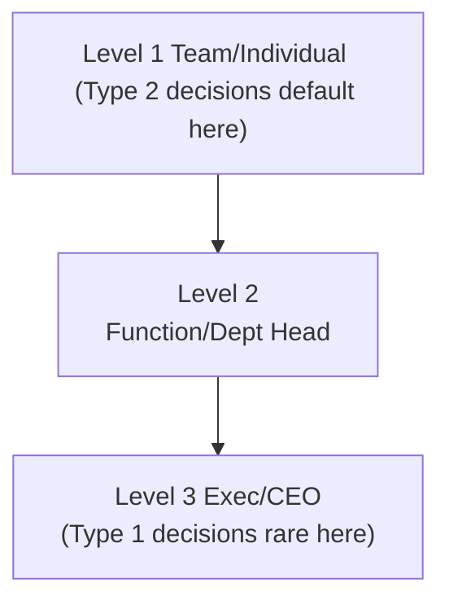

# Chapter 06: Decision Architecture

## Why This Chapter Matters
As an executive, you’re less valuable as a **decision maker** and more valuable as a **decision architect** — designing **how** and **where** decisions get made so the organization can act fast without chaos.

## What Goes Wrong Without This
- Over-escalation: Leaders become bottlenecks for reversible decisions.
- Shadow decisions: Outcomes decided informally without roles or records.
- Consensus paralysis: Endless alignment attempts stall Type 1 calls.
- No decision memory: Repeated debates because briefs and logs don’t exist.

---

## Three Truths About Decisions at Scale
There are three key truths about decisions at scale: unclear ownership is the #1 cause of slow or bad decisions; speed matters, but only if you protect quality; and process beats heroics, as consistent frameworks outperform ad-hoc “saves.”

---

## The Two Door Model (Jeff Bezos)
Decisions fall into two types: Type 1 (One-Way Door), which are hard to reverse and high stakes, needing deliberate process (e.g., entering a new market or acquiring a company); and Type 2 (Two-Way Door), which are reversible and low stakes, biasing for speed (e.g., changing a marketing tagline or adjusting a UI color). Push Type 2 decisions as far down the org as possible.

---

## Decision Frameworks That Scale
This book standardizes on **RAPID** as the default decision framework. Use **DARCI** only where it’s already entrenched; map roles carefully.

- **RAPID** (Bain)  
  - **R**ecommend: Writes the brief, proposes.  
  - **A**gree: Has veto power on certain aspects.  
  - **P**erform: Executes after decision.  
  - **I**nput: Consulted before decision.  
  - **D**ecide: The final call.

- DARCI mapping (if needed)  
  - R (RAPID) ≈ Driver/Responsible (DARCI) for drafting and owning the brief  
  - A (RAPID) ≈ Approver (DARCI) with explicit veto scope  
  - P (RAPID) ≈ Responsible (DARCI) execution DRI  
  - I (RAPID) ≈ Consulted/Informed (DARCI)  
  - D (RAPID) ≈ Approver/Final decision (DARCI)

### Escalation Ladder — Visual

---

## The Decision Brief (1–2 Pages)
**Purpose**: Avoids “decision by PowerPoint” and gives a reusable artifact.  
**Sections**:
1. **Context** — What’s the decision and why now?
2. **Options considered** — At least 2 real alternatives.
3. **Recommendation** — Chosen path, with rationale.
4. **Risks & mitigations** — What could go wrong, and countermeasures.
5. **Impact** — On customers, financials, ops, brand.
6. **Decision rights (RAPID)** — Who Decides, who Performs (DRI), who’s Informed.

---

## Decision Escalation Ladder
- **Level 1**: Individual/team decides within agreed boundaries.
- **Level 2**: Department head or functional leader decides.
- **Level 3**: Exec team or CEO decides (rare).

Escalation should be **explicit and fast** — no decision should wait in limbo.

---

## The Decision Audit
Quarterly, review:
- How many decisions were made at each level.
- Time from proposal to decision.
- % of decisions that hit desired outcome.
- Lessons from reversals or misses.

---

## Pitfalls to Avoid
Avoid these decision-making pitfalls:
- **Consensus paralysis** — Not every decision needs everyone’s blessing.
- **Shadow decisions** — Outcomes decided informally without accountability.
- **Over-escalation** — Leaders pulled into Type 2 decisions that could be delegated.
- **No decision memory** — Repeating debates because no record exists.

---

## 90-Minute Decision Architecture Workshop
1. **Decision mapping (20m)** — List 10 recurring decisions; classify as Type 1 or 2.
2. **Assign rights (20m)** — Apply RAPID to each (map to DARCI if your org uses it).
3. **Draft briefs (20m)** — Pick 2 big upcoming decisions; write briefs.
4. **Design escalation (15m)** — Agree on triggers and turnaround SLAs.
5. **Set audit rhythm (15m)** — Quarterly review with metrics.

---

## Stage & Context Adaptations
- Startup/Turnaround: Favor speed; default Type 2 to teams; keep briefs lightweight.
- Scaleup: Formalize RAPID and escalation SLAs; start decision audits.
- Enterprise: Strong decision memory; board-linked escalations; compliance input.
- Regulated: Pre-define veto scopes with Legal/Risk; record rationales.
- Remote/Distributed: Use memos/comments; async approvals; clear SLAs.

## Mini‑Case: Unsticking Product Decisions
A product org suffered 3-week delays on simple choices. By classifying decisions and pushing Type 2 to teams with RAPID and a 72-hour SLA, cycle time dropped 45% and exec escalations were cut in half.

---

## Connects to
- [Chapter 01: The Executive Shift](chapter-01-the-executive-shift.md) (Decision Rights That Scale You (installing rights early))
- [Chapter 03: The Operating System](chapter-03-the-operating-system.md) (Forums and standards for decision flow)
- [Chapter 04: Capital Allocation](chapter-04-capital-allocation.md) (Kill criteria set at approval time)
- [Chapter 12: Measuring What Matters](chapter-12-measuring-what-matters.md) (Decision metrics and audit)

---

## Chapter 6 “Ship It” Checklist
- [ ] Decision rights mapped and visible (RAPID)
- [ ] Type 1 vs Type 2 decisions defined
- [ ] Decision brief template in use
- [ ] Escalation ladder agreed
- [ ] Quarterly decision audit scheduled

## Next
- [Chapter 07: Executive Communication](chapter-07-executive-communication.md)

## Embedded Templates

- [Decision Rights Map](./templates/decision_rights_map.md)
- [Decision Brief](./templates/decision_brief.md)
