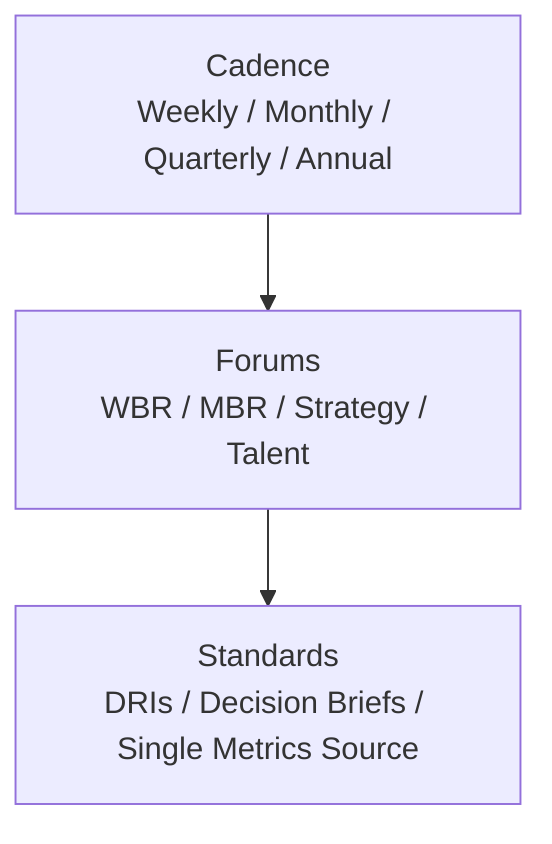

# Executive Leadership 301 — Chapter 3: The Operating System

## Why This Chapter Matters
A company without an operating system (OS) is like a band without rhythm — even talented players sound chaotic. Your OS comprises the cadence, forums, and processes that make the organization’s work visible, decisions fast, and priorities consistent.

## The Three Layers of an Executive Operating System
An effective executive operating system has three layers: cadence, which determines when things happen (weekly, monthly, quarterly rhythms); forums, which define where and how you meet to decide, review, and unblock; and standards, which establish the agreed way work is planned, tracked, and measured.

### OS Layers — Visual

## Cadence: Turning Time into a Force Multiplier
Default executive cadence:
- **Weekly** — Execution focus  
  *Weekly Business Review (WBR)*: metrics, blockers, immediate actions.
- **Monthly** — Portfolio health  
  *Monthly Business Review (MBR)*: bets, budget, risks, adjustments.
- **Quarterly** — Strategic alignment  
  *Quarterly Strategy Review*: market updates, roadmap pruning, thesis checks.
- **Annually** — Direction and capital  
  Annual planning, budget setting, and talent review.

**Tip**: Cadence is about **forcing function**, not ceremony. Every meeting must move a decision forward.

## Forums: The Decision Marketplaces
Key forums to establish:
- **WBR (Weekly Business Review)**  
  - Inputs: standardized dashboard, variance notes, owner updates.  
  - Output: decisions, owner assignments, follow-up due dates.
- **MBR (Monthly Business Review)**  
  - Inputs: portfolio metrics, project health, capital use, risk register.  
  - Output: reprioritizations, reallocation of resources, kill/accelerate decisions.
- **Talent Review**  
  - Focus on top 5% and bottom 5%, succession planning, and recruiting priorities.
- **Crisis/Situation Room**  
  - Rapid alignment during incidents; predefined roles and escalation rules.

## Standards: Reducing Friction in How Work Happens
Examples:
- **Single metrics source** — One dashboard everyone uses.
- **Decision briefs (RAPID)** — A 1–2 page memo and RAPID roles before major choices (no surprise decks).
- **Project health codes** — Green/Yellow/Red with agreed definitions.
- **Owner clarity** — Every deliverable has a *Directly Responsible Individual (DRI)*.

## Building Your OS
1. **Map your current forums** — List every meeting, its purpose, inputs, and outputs.
2. **Cut or merge low-leverage forums** — If it doesn’t drive decisions, kill it or change it.
3. **Align cadences** — Make sure decision frequency matches the pace of the market.
4. **Instrument metrics** — Every forum needs 3–5 key metrics it owns.

## Pitfalls to Avoid
To build a strong OS, avoid these pitfalls:
- **Metrics soup** — Too many numbers dilute focus; pick the vital few.
- **No owner** — Without a DRI, every forum becomes a discussion club.
- **Deck theatre** — Endless presentation prep instead of actual decision-making.
- **Unaligned cadences** — If product reviews are quarterly but market shifts monthly, you’re too slow.

## 90-Minute OS Workshop
1. **Forum Inventory (20m)** — List all recurring meetings; mark owner, inputs, outputs.
2. **Cadence Alignment (20m)** — Match each decision type to its optimal rhythm.
3. **Standard Setting (20m)** — Agree on decision briefs, dashboards, and project health definitions.
4. **Kill/Merge Decisions (20m)** — Remove low-value forums; merge redundant ones.
5. **Owner Assignments (10m)** — Each forum gets a DRI and decision accountability.

## Stage & Context Adaptations
- Startup/Turnaround: Trim to WBR + ad-hoc Situation; keep metrics minimal; prioritize DRIs.
- Scaleup: Formalize MBR; add Strategy Review; enforce decision briefs.
- Enterprise: Strengthen governance; integrate board packet cadence; decision logs.
- Regulated: Embed compliance in WBR/MBR inputs; risk register reviewed monthly.
- Remote/Distributed: Pre-read memos; async updates; recorded forums.

## Mini‑Case: OS in 30 Days
A growth-stage company mapped 27 meetings, killed 9, merged 6, and installed WBR/MBR with single metrics source. Decision throughput rose 30% and prep time dropped by half as decks were replaced with one-page briefs.

## Connects to
- [Chapter 1: The Executive Shift](executive_leadership_301_chapter_1.md) (Core rituals (WBR/MBR) and executive charter)
- [Chapter 6: Decision Architecture](executive_leadership_301_chapter_6.md) (Decision briefs and RAPID roles)
- [Chapter 12: Measuring What Matters](executive_leadership_301_chapter_12.md) (Single source of metrics and dashboard design)
- [Chapter 4: Capital Allocation](executive_leadership_301_chapter_4.md) (Portfolio decisions and kill criteria in MBR)

## Chapter 3 “Ship It” Checklist
- [ ] Written OS map with cadence, forums, and standards
- [ ] DRIs assigned for all recurring forums
- [ ] WBR/MBR agendas documented and shared
- [ ] Decision briefs template in circulation (RAPID)
- [ ] Single source of metrics live

## Next
- [Chapter 4: Capital Allocation](executive_leadership_301_chapter_4.md)

## Embedded Templates

# WBR Agenda

## Blank Template

### WBR Agenda - [Week of Date]

### Objective
[Brief objective]

### Attendees
[List]

### Agenda ([Duration])
1. **[Section] ([Time])** - [Owner]  
   - [Details]

[Add sections]

### Prep
- [Requirements]

Standing Rule: [Rules]

## Practical Example

### WBR Agenda - Week of October 2, 2023

### Objective
Review metrics, unblock issues, align on weekly priorities. Data-driven; pre-read dashboard.

### Attendees
Exec staff, DRIs. Facilitator: COO. (60-90 mins)

### Agenda
1. **Metrics Review (20m)** - All  
   - Dashboard walkthrough: Variances, trends.  
   - Owners explain reds/yellows.

2. **Blockers & Unblockers (20m)** - Round-robin  
   - Top 3 issues per function.  
   - Immediate decisions/assignments.

3. **Deep Dive: Sales Pipeline (20m)** - VP Sales  
   - Funnel health, win rates, forecasts.

4. **Wins & Learnings (10m)** - All  
   - Quick shares.

5. **Actions & Closes (10m)** - COO  
   - Commitments, due dates, owners.

### Prep
- Update dashboard by EOD Monday.
- No slides; use shared doc for notes.

Standing Rule: Same metrics every week; focus on exceptions.

# MBR Agenda

## Blank Template

### MBR Agenda - [Month Year]

### Objective
[Brief objective]

### Attendees
[List roles]

### Agenda ([Duration])
1. **[Section] ([Time])** - [Owner]  
   - [Details]

[Add sections]

### Prep
- [Requirements]

Next MBR: [Date]

## Practical Example

### MBR Agenda - October 2023

### Objective
Review portfolio health, adjust bets, manage risks. Memo-led; read in advance.

### Attendees
Exec team, functional leads. Facilitator: COO.

### Agenda (2 hours)
1. **Opening & Metrics Review (20m)** - COO  
   - KPI dashboard variances; NSM trends.

2. **Portfolio Updates (40m)** - VP Product/Sales  
   - Bet progress; kill criteria checks.
   - Reallocations needed?

3. **Risk Register (20m)** - CRO  
   - Top risks; mitigations; new entries.

4. **Deep Dive: Q4 Planning (30m)** - CEO  
   - Strategic adjustments; decisions.

5. **Talent Spotlight (20m)** - CHRO  
   - Key hires, succession gaps.

6. **Closes & Actions (10m)** - All  
   - Commitments, owners, due dates.

### Prep
- Submit updates by EOD Wednesday.
- Read memo pack (5 pages max).

Next MBR: November 15.
