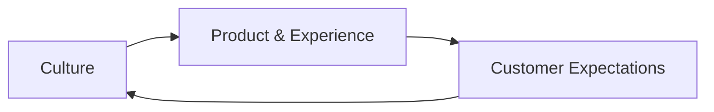

# Executive Leadership 301 — Chapter 9: Culture by Design

## Why This Chapter Matters
Culture isn’t just “how we do things around here.”  
It’s the **default operating system** of the company — the unwritten rules that guide decisions when no one is watching.  
At the executive level, your job is to **design**, **model**, and **reinforce** the culture you want.

---

## The Culture Equation
```
Culture = Values (what we believe) 
        + Norms (how we behave) 
        + Systems (what we reward & punish)
```
If any element is missing, culture drifts toward convenience, not excellence.

### Culture → Product → Culture — Visual


---

## Culture → Product → Culture Loop
Culture shapes how products are built, which in turn shapes customer experience, and customer expectations feed back into internal behaviors. For example, Amazon’s obsession with speed and low prices reinforced customer expectations, pushing internal teams to maintain operational excellence.

---

## Defining Culture Intentionally
Define culture with 4–6 clear, specific, non-generic values; map each value to visible actions and anti-patterns; include real examples of values in action through stories; establish regular practices that reinforce values via rituals; and use visual cues, language, and traditions as symbols that signal what matters.

---

## Operationalizing Culture
- **Hiring** — Screen for values alignment as hard as for skills.
- **Onboarding** — Teach values with stories and case studies.
- **Performance reviews** — Measure *how* results are achieved, not just *what* is achieved.
- **Recognition programs** — Publicly reward behaviors that match the desired culture.
- **Exit process** — Offboard in a way that reinforces dignity and values.

---

## Cultural Maintenance
- **Leader modeling** — Executives must live the values visibly.
- **Pulse surveys** — Quick, frequent temperature checks on culture health.
- **Cultural onboarding for leaders** — Ensure new execs align before they change norms.
- **Pruning** — Actively remove behaviors, policies, and people that violate core values.

---

## Pitfalls to Avoid
Watch for:
- **Poster values** — Values written on walls but ignored in practice.
- **Value sprawl** — Too many “values” dilute focus.
- **Tolerating culture violations for high performers** — This erodes trust faster than anything.
- **Culture ossification** — Refusing to evolve values as the business changes.

---

## 90-Minute Culture by Design Workshop
1. **Value definition (20m)** — Review and refine the core 4–6 values.
2. **Behavior mapping (20m)** — For each value, list visible behaviors and anti-patterns.
3. **Ritual audit (20m)** — List existing rituals; prune or add to reinforce values.
4. **Story collection (20m)** — Gather 3–5 true stories that illustrate each value.
5. **Symbol check (10m)** — Ensure visual cues and language match desired culture.

---

## Stage & Context Adaptations
- Startup/Turnaround: Few values; high clarity on anti-patterns; leadership modeling daily.
- Scaleup: Codify rituals; embed in hiring and onboarding; prune misaligned practices.
- Enterprise: Refresh values with strategy; avoid ossification; guard against politics.
- Regulated: Emphasize integrity, transparency; align incentives with compliance.
- Remote/Distributed: Written norms; explicit rituals; async recognition.

## Mini‑Case: Rituals Over Posters
An org with “innovation” posters still punished risk. By adding monthly “failed experiment” demos and rewarding learnings, they unlocked bolder product bets and higher engagement.

---

## Embedded Template: Culture Doc

# Culture Doc

## Blank Template

### Our Mission
[Company mission statement]

### Core Values
1. **[Value 1]** - [Brief description]
2. **[Value 2]** - [Brief description]
[Add 4-6 values]

### Behaviors & Anti-Patterns
#### [Value 1]
- **Do**: [Expected behaviors]
- **Don't**: [Behaviors to avoid]

[Repeat for each value]

### Rituals
- [Ritual name]: [Description, cadence]

### How We Hire & Onboard
- [Hiring practices]
- [Onboarding process]

This doc evolves—review [cadence].

## Practical Example

### Our Mission
At Acme Tech, we build innovative SaaS solutions that empower small businesses to thrive in a digital world.

### Core Values
1. **Customer Obsession** - We start with the customer and work backwards.
2. **Ownership** - We act like owners, thinking long-term and delivering results.
3. **Innovation** - We embrace bold ideas and learn from failure.
4. **Integrity** - We do the right thing, even when no one is watching.
5. **Teamwork** - We collaborate openly and lift each other up.

### Behaviors & Anti-Patterns
#### Customer Obsession
- **Do**: Dive deep into customer feedback; prioritize features based on user needs.
- **Don't**: Ignore support tickets or assume we know better than the customer.

#### Ownership
- **Do**: Take initiative on blockers; follow through on commitments.
- **Don't**: Blame others or wait for permission on obvious improvements.

#### Innovation
- **Do**: Experiment with new tech; share learnings from failures in demos.
- **Don't**: Stick to "the way we've always done it" without questioning.

#### Integrity
- **Do**: Be transparent about mistakes; uphold ethical standards in deals.
- **Don't**: Cut corners for short-term gains.

#### Teamwork
- **Do**: Give constructive feedback; celebrate team wins.
- **Don't**: Hoard information or compete internally.

### Rituals
- **Weekly Wins & Learnings**: Friday all-hands sharing successes and failures.
- **Customer Day**: Monthly rotation where everyone handles support tickets.
- **Innovation Hackathon**: Quarterly 48-hour event for bold ideas.
- **Values Awards**: Monthly recognition for embodying core values.

### How We Hire & Onboard
- Screen for values fit in interviews with behavioral questions.
- Onboarding includes "Culture 101" session with stories and role-playing.

This doc evolves with our company—review and update quarterly.

## Connects to
- [Chapter 5: Org Design & Talent Density](executive_leadership_301_chapter_5.md) (Org design, spans/layers, and talent density)
- [Chapter 3: The Operating System](executive_leadership_301_chapter_3.md) (Rituals embedded in the operating system)
- [Chapter 7: Executive Communication](executive_leadership_301_chapter_7.md) (Storytelling that reinforces values)
- [Chapter 12: Measuring What Matters](executive_leadership_301_chapter_12.md) (Culture health metrics (engagement, attrition, inclusion))

---

## Chapter 9 “Ship It” Checklist
- [ ] Values defined and behavior-mapped
- [ ] Rituals aligned with values
- [ ] Stories collected and in circulation
- [ ] Leaders trained in culture modeling
- [ ] Pulse survey mechanism active

## Next
- [Chapter 10: Product & Platform Scaling](executive_leadership_301_chapter_10.md)
