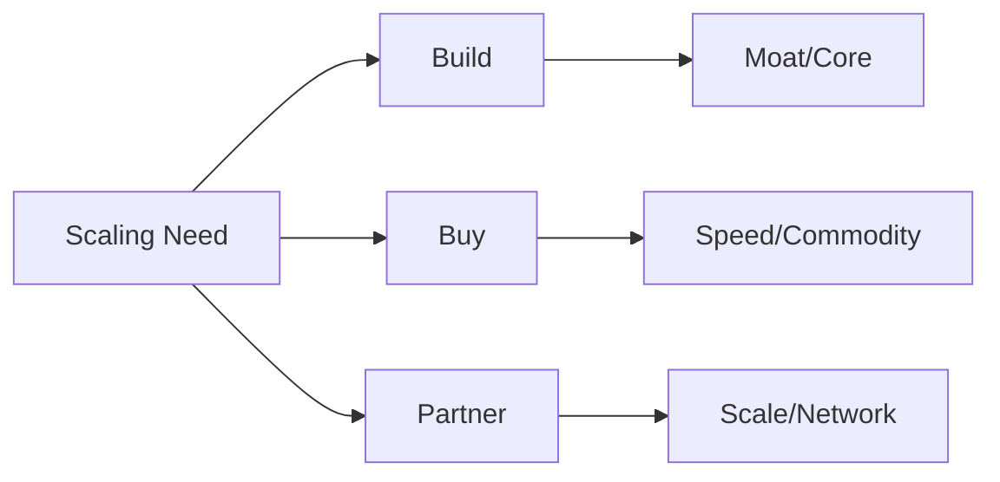

# Executive Leadership 301 — Chapter 10: Product & Platform Scaling

## Why This Chapter Matters
At some point, the bottleneck to growth isn’t market demand — it’s the company’s **ability to deliver at scale**.  
Scaling is about **adding capacity and capability faster than complexity increases**.

---

## The Three Scaling Dimensions
Scaling involves three dimensions: product scaling to expand reach, features, and markets; platform scaling to increase technical capacity, reliability, and interoperability; and organizational scaling to grow teams, processes, and decision-making without slowing down.

---

## Product Scaling Principles
Win in one beachhead before expanding by nailing a niche first; add features with discipline, tying every new capability to revenue, retention, or moat; balance new vs. core to avoid starving proven products; and build for internationalization early if global is in your roadmap, including multiple languages, currencies, and regulations.

---

## Platform Scaling Principles
- **Reliability before speed** — Downtime kills trust faster than slow feature velocity.
- **Technical debt is capital** — Manage it deliberately; pay it down when the interest is high.
- **APIs and modularity** — Design systems to evolve independently.
- **Observability as a scaling lever** — Logging, tracing, and metrics let you grow without losing control.

---

## Organizational Scaling Principles
- **Autonomous teams** — Create squads/pods with clear goals and metrics.
- **Shared services** — Centralize capabilities like data, infra, and security to reduce duplication.
- **Scaling rituals** — Quarterly strategy reviews, cross-team demos, and incident reviews.
- **Hire ahead of need** — Especially in leadership roles where ramp time is long.

---

## Build/Buy/Partner Decisions
- **Build** when it’s core to your moat or competitive advantage.
- **Buy** when speed matters more than uniqueness.
- **Partner** when scale or network effects are better achieved with allies.

### Build/Buy/Partner — Visual

---

## Pitfalls to Avoid
Avoid:
- **Scaling chaos** — Growing headcount faster than clarity.
- **Over-optimizing too early** — Adding heavy process before product-market fit is solid.
- **Ignoring platform limits** — Latency, cost, and compliance can become silent killers.
- **“Big bang” rewrites** — They stall progress; favor incremental modernization.

---

## 90-Minute Product & Platform Scaling Workshop
1. **Bottleneck mapping (20m)** — Identify current constraints in product, platform, and org.
2. **Impact mapping (20m)** — Link each bottleneck to business impact.
3. **Prioritization (20m)** — Rank scaling initiatives by ROI and urgency.
4. **Build/Buy/Partner (20m)** — Decide the right approach for top 3 initiatives.
5. **Metrics & owners (10m)** — Assign success metrics and DRIs.

---

## Stage & Context Adaptations
- Startup/Turnaround: Don’t over-process; fix the constraint; focus on reliability basics.
- Scaleup: Introduce SLOs/error budgets; platform modularity; FinOps discipline.
- Enterprise: Platform standardization; shared services; governance for changes.
- Regulated: Compliance built-in; data residency; audit trails.
- Remote/Distributed: Async demos; incident write-ups; platform dashboards.

## Mini‑Case: Reliability as Growth Unlock
Feature teams were blocked by incidents. Introducing SLOs and an error budget policy cut paging by 60% and doubled feature throughput within two quarters.

---

## Connects to
- [Chapter 4: Capital Allocation](executive_leadership_301_chapter_4.md) (Capital allocation for scaling bets)
- [Chapter 3: The Operating System](executive_leadership_301_chapter_3.md) (OS rituals for cross-team coordination)
- [Chapter 12: Measuring What Matters](executive_leadership_301_chapter_12.md) (Metrics for platform reliability and cost)
- [Chapter 6: Decision Architecture](executive_leadership_301_chapter_6.md) (Decision rights for Build/Buy/Partner choices)

---

## Chapter 10 “Ship It” Checklist
- [ ] Scaling priorities identified across product, platform, and org
- [ ] Clear sequencing of initiatives
- [ ] Build/Buy/Partner decisions made
- [ ] Metrics and owners assigned
- [ ] Platform observability in place

## Next
- [Chapter 11: Crisis Leadership](executive_leadership_301_chapter_11.md)

## Embedded Template: Build/Buy/Partner Scorecard

# Build/Buy/Partner Scorecard

## Blank Template

### Initiative: [Describe the initiative]

### Criteria
| Criterion | Weight | Build Score | Buy Score | Partner Score | Notes |
|-----------|--------|-------------|-----------|---------------|-------|
| Strategic Fit | % |  |  |  |  |
| Time to Market | % |  |  |  |  |
| Cost | % |  |  |  |  |
| Risk | % |  |  |  |  |
| Scalability & Control | % |  |  |  |  |
| Team Impact | % |  |  |  |  |
| ROI Projection | % |  |  |  |  |

### Total Scores
- Build: [Calculate]
- Buy: [Calculate]
- Partner: [Calculate]

### Recommendation
[Recommended option and rationale]

### Decision
- [ ] Build
- [ ] Buy
- [ ] Partner

Approved by: [Name], Date: [Date]

## Practical Example

### Initiative: AI-Powered Analytics Feature for SaaS Platform

### Criteria
| Criterion | Weight | Build Score | Buy Score | Partner Score | Notes |
|-----------|--------|-------------|-----------|---------------|-------|
| Strategic Fit (Alignment with core moat) | 25% | 8 | 5 | 7 | Building strengthens our data IP; buying commoditizes it; partnering shares value. |
| Time to Market | 20% | 4 | 9 | 7 | Build takes 9-12 months; buy integrates in 3 months; partner in 4-6 months. |
| Cost (Initial + Ongoing) | 15% | 6 | 7 | 8 | Build: $2M dev + $500K/year; Buy: $1.5M acquisition + $300K/year; Partner: $800K setup + revenue share. |
| Risk (Technical, Market, Legal) | 15% | 5 | 6 | 7 | Build has execution risk; buy has integration risk; partner has dependency risk. |
| Scalability & Control | 10% | 9 | 6 | 5 | Full control with build; limited with buy/partner. |
| Team Impact (Skills, Morale) | 10% | 7 | 5 | 6 | Build grows internal AI expertise; buy may require layoffs; partner maintains focus. |
| ROI Projection | 5% | 8 | 7 | 6 | Build: 3x ROI in 2 years; Buy: 2.5x; Partner: 2x. |

### Total Scores
- Build: (8*0.25) + (4*0.20) + (6*0.15) + (5*0.15) + (9*0.10) + (7*0.10) + (8*0.05) = 7.15
- Buy: 6.45
- Partner: 6.75

### Recommendation
Build internally to maintain control and build long-term moat, despite longer timeline. Mitigate time risk by phasing development.

### Decision
- [ ] Build
- [ ] Buy
- [ ] Partner

Approved by: [DRI Name], Date: [Date]
