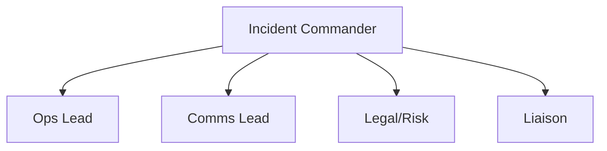

# Executive Leadership 301 — Chapter 11: Crisis Leadership

## Why This Chapter Matters
Crises are inevitable — outages, PR blow-ups, legal challenges, market shocks.  
How you lead in those moments defines **trust**, **reputation**, and sometimes **survival**.

---

## The Crisis Leadership Equation
```
Crisis Impact = Event Severity × Response Quality
```
You can’t always control severity, but you can radically change the outcome through **preparedness and execution**.

---

## The Four Crisis Phases
Crises unfold in four phases: detection to spot the signal early; stabilization to stop the bleeding; resolution to fix the root cause; and recovery to rebuild trust, learn, and strengthen.

---

## The Command Tempo Model
Maintain a high tempo with rapid cycles of assess, decide, and act; ensure a clear decision-maker with no ambiguity about who’s in charge; use a single source of truth for updates; and time-box actions to move in minutes or hours, not days.

### ICS Roles — Visual


---

## Roles in the Crisis Room
- **Incident Commander** — Owns decisions, sets tempo.
- **Ops Lead** — Coordinates internal teams/resources.
- **Comms Lead** — Manages internal and external messaging.
- **Legal/Risk Lead** — Tracks compliance and exposure.
- **Liaison** — Handles key stakeholders (board, customers, regulators).

---

## Crisis Communication Rules
- **Acknowledge fast** — Silence looks like incompetence or hiding.
- **Tell what you know and what you don’t** — Reduces speculation.
- **Commit to updates** — Set intervals (e.g., every 2 hours).
- **Align internal & external messages** — No surprises for your own team.

---

## The Pre-Mortem Technique
Run **pre-crisis drills**:
1. Imagine the worst plausible crisis.
2. Map the first 24 hours — actions, owners, comms.
3. Test systems and people against the scenario.
4. Refine the playbook.

---

## Recovery: Coming Back Stronger
- **Debrief** — Within 72 hours, capture lessons while fresh.
- **Fix permanently** — Address root causes, not symptoms.
- **Tell the recovery story** — Show stakeholders how the org improved.
- **Update playbooks** — Every crisis makes the next one easier.

---

## Pitfalls to Avoid
Avoid:
- **Decision drift** — Too many voices, no clear owner.
- **Comms blackout** — Creates panic internally and externally.
- **Heroics over systems** — Burning out a few stars instead of using process.
- **Failing to learn** — Repeating the same mistakes in the next crisis.

---

## 90-Minute Crisis Leadership Workshop
1. **Scenario selection (20m)** — Choose a high-risk plausible crisis.
2. **Role assignment (15m)** — Define Incident Commander, Ops Lead, Comms Lead, Legal, Liaison.
3. **First 24h plan (20m)** — Draft step-by-step actions.
4. **Comms drill (20m)** — Write and deliver the first internal + external message.
5. **Debrief & improve (15m)** — Capture lessons and update playbook.

---

## Stage & Context Adaptations
- Startup/Turnaround: Lightweight ICS; pre-written holding statement; CEO often IC.
- Scaleup: Formal ICS rotation; single source of truth; regular drills.
- Enterprise: Cross-function ICS; regulatory reporting; board liaison plan.
- Regulated: Required notifications; legal reviews; evidence capture.
- Remote/Distributed: Incident channels; on-call rotations; async status page.

## Mini‑Case: PR Crisis Contained
A social backlash grew over a product change. Within 2 hours, the team acknowledged, paused the change, opened a feedback channel, and scheduled updates. The issue cooled within 24 hours; the post-mortem improved change management.

---

## Connects to
- [Chapter 7: Executive Communication](executive_leadership_301_chapter_7.md) (Crisis communication principles)
- [Chapter 8: Governance & Stakeholders](executive_leadership_301_chapter_8.md) (Governance and board relations in crisis)
- [Chapter 3: The Operating System](executive_leadership_301_chapter_3.md) (Situation Room forum design)
- [Chapter 12: Measuring What Matters](executive_leadership_301_chapter_12.md) (Reliability and risk metrics)

---

## Chapter 11 “Ship It” Checklist
- [ ] Crisis playbook with clear roles and triggers
- [ ] Regular pre-mortem drills
- [ ] Single source of truth for crisis updates
- [ ] Pre-approved comms templates
- [ ] Recovery and learning loop in place

## Next
- [Chapter 12: Measuring What Matters](executive_leadership_301_chapter_12.md)

## Embedded Template: Crisis Playbook

# Crisis Playbook

## Blank Template

### Phase 1: Detection ([Timeframe])
- **Trigger**: [Description]
- **Actions**:
  - [Role]: [Action]

### Phase 2: Stabilization ([Timeframe])
- **Roles**:
  - IC: [Name/Role]
  - Ops: [Name/Role]
  - [Other roles]
- **Actions**: [Steps]

### Phase 3: Resolution ([Timeframe])
- **Actions**: [Steps]

### Phase 4: Recovery ([Timeframe])
- **Actions**: [Steps]

### Comms Templates
- Internal: "[Template]"
- External: "[Template]"

### Escalation
- [Criteria]

Tested: [Cadence]

## Practical Example

### Phase 1: Detection (0-1 Hour)
- **Trigger**: Alert from monitoring or report.
- **Actions**:
  - Incident Commander (IC): Assemble team via #crisis channel.
  - Ops Lead: Isolate affected systems; assess scope.
  - Comms Lead: Prepare holding statement.

### Phase 2: Stabilization (1-4 Hours)
- **Roles**:
  - IC: [CTO]
  - Ops: [Head of Security]
  - Comms: [PR Director]
  - Legal: [General Counsel]
  - Liaison: [CEO for board/customers]
- **Actions**: Contain breach; notify regulators if required (e.g., GDPR 72h).

### Phase 3: Resolution (4-24 Hours)
- **Actions**:
  - Root cause analysis.
  - Deploy fixes/patches.
  - Forensic audit.

### Phase 4: Recovery (24+ Hours)
- **Actions**:
  - Customer notifications.
  - Post-mortem within 72h.
  - Update security policies.

### Comms Templates
#### Internal Holding: "We are investigating a potential security incident. Non-essential access paused. Updates every 2h."
#### External: "Acme Tech detected unauthorized access. No evidence of data compromise. More info soon."

### Escalation
- If >10% users affected, notify board immediately.

Tested: Quarterly drills.
