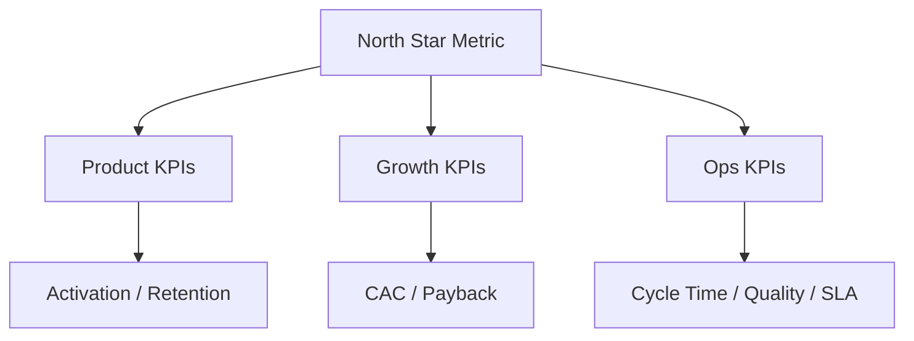

# Executive Leadership 301 — Chapter 12: Measuring What Matters

## Why This Chapter Matters
At the executive level, metrics aren’t just numbers — they are **commitments**.  
They define how success is judged, what gets attention, and what resources get allocated.  
The wrong metrics = the wrong behaviors.

---

## The Three Levels of Metrics
Metrics operate at three levels: the North Star Metric (NSM), a single measure capturing long-term value creation (e.g., Spotify’s “Time spent listening”); KPI Trees that break down the NSM into supporting metrics for each department; and operational metrics, the daily/weekly indicators driving front-line action.

### KPI Tree — Visual


---

## Characteristics of Good Metrics
Good metrics are aligned to strategy, actionable with a clear owner who can move them, comparable over time or against benchmarks, and balanced to avoid perverse incentives by pairing with counter-metrics.

---

## The Metrics Stack
**Top layer** — Board & exec dashboard (NSM + top KPIs)  
**Middle layer** — Functional dashboards (marketing, product, ops)  
**Bottom layer** — Operational boards (team-specific, tactical metrics)

Add the **DRI** for each metric on every layer.

---

## Metric Design Principles
- **Lagging vs. leading** — Lagging tells you *what happened*, leading predicts *what will happen*.
- **Vanity vs. value** — Favor metrics that reflect outcomes, not appearances.
- **Perverse incentive check** — Every metric should have a paired counterbalance.  
  *Example*: Speed of feature releases ↔ % of releases without critical bugs.

---

## Unit Economics for Executives
Track the **profitability of the business model at the smallest meaningful unit**:
- CAC (Customer Acquisition Cost)
- LTV (Lifetime Value)
- Contribution margin
- Payback period

When unit economics are strong, growth scales sustainably. When weak, growth scales losses.

---

## Dashboards That Drive Action
- **One-page view** — No more than 8–10 metrics per audience.
- **Owner names** — Every metric has a DRI.
- **Traffic-light status** — Green/Yellow/Red to signal focus areas.
- **Narrative context** — Metrics alone don’t explain *why*.

---

## Measurement Cadence
- **Weekly** — Operational reviews, short-term adjustments.
- **Monthly** — KPI reviews, resource reallocation.
- **Quarterly** — Strategic metric reviews, NSM validation.
- **Annually** — Metric reset based on strategy shifts.

---

## Pitfalls to Avoid
Steer clear of:
- **Metric creep** — Tracking too many dilutes focus.
- **Gaming the numbers** — When incentives drive metric manipulation.
- **Blind spots** — Ignoring metrics for risk, quality, or employee health.
- **Static metrics** — Failing to evolve measures as the business changes.

---

## 90-Minute Measuring What Matters Workshop
1. **NSM definition (20m)** — Agree on the single most important measure of long-term value.
2. **KPI tree build (20m)** — Map department metrics to NSM.
3. **Counter-metric pairing (20m)** — Identify perverse incentive risks and add balances.
4. **Dashboard design (20m)** — Build or refine top-layer dashboards.
5. **Cadence lock (10m)** — Set review frequency and owners.

---

## Stage & Context Adaptations
- Startup/Turnaround: One-page metrics; emphasize leading indicators; weekly iteration.
- Scaleup: Build KPI trees; add counter-metrics; institute MBR reviews.
- Enterprise: Tight governance of definitions; audit trails; link to incentives.
- Regulated: Include risk/compliance metrics; evidence for audits; thresholds.
- Remote/Distributed: Async dashboards; narrative updates accompany graphs.

## Mini‑Case: Fixing Vanity Metrics
A team tracked signups without activation. By adopting a KPI tree tied to NSM (retention), they shifted focus to activation and D30 retention. Growth slowed briefly but LTV rose 22% and payback improved by 3 months.

---

## Connects to
- [Chapter 3: The Operating System](executive_leadership_301_chapter_3.md) (Single source of metrics and OS forums (WBR/MBR))
- [Chapter 4: Capital Allocation](executive_leadership_301_chapter_4.md) (Portfolio ROI tracking and kill criteria triggers)
- [Chapter 6: Decision Architecture](executive_leadership_301_chapter_6.md) (Decision audits and RAPID DRIs tied to metrics)

---

## Chapter 12 “Ship It” Checklist
- [ ] North Star Metric defined and communicated
- [ ] KPI tree aligned to strategy
- [ ] Counter-metrics in place to prevent gaming
- [ ] Dashboards live with owners assigned (DRIs listed)
- [ ] Metric review cadence locked

## Next
- [Glossary](executive_leadership_301_glossary.md)

## Embedded Templates

# KPI Tree Worksheet

## Blank Template

### North Star Metric (NSM): [Define NSM]

### Level 1 Branches
- [Branch 1]: [Description]
- [Branch 2]: [Description]

### Level 2 Sub-Metrics
#### [Branch 1] (DRI: [Role])
- [Sub-metric]: [Target]
- [Sub-metric]: [Target]

[Repeat for branches]

### Counter-Metrics
- [To balance X]: [Metric]

### Visualization
```
NSM
├── Branch 1
│   ├── Sub 1
│   └── Sub 2
└── Branch 2
```

Review: [Cadence]

## Practical Example

### North Star Metric (NSM): Monthly Recurring Revenue (MRR)

### Level 1 Branches
- Acquisition: New MRR
- Retention: Churn Rate
- Expansion: Upsell MRR

### Level 2 Sub-Metrics
#### Acquisition (DRI: VP Marketing)
- Leads Generated: 5K/mo (Target)
- Conversion Rate: 20%
- Avg Deal Size: $500

#### Retention (DRI: VP Product)
- Activation Rate: 70%
- Churn Rate: <5%
- NPS Score: >50

#### Expansion (DRI: VP Sales)
- Upsell Rate: 15%
- Cross-Sell Attachments: 25%
- Expansion MRR: $100K/mo

### Counter-Metrics
- To balance Acquisition: CAC Payback <12mo
- To balance Retention: Support Ticket Volume <1% of users

### Visualization
```
NSM: MRR
├── Acquisition
│   ├── Leads
│   └── Conversion
├── Retention
│   ├── Activation
│   └── Churn
└── Expansion
    ├── Upsell
    └── Cross-Sell
```

Review: Monthly in MBR.

# Dashboard Spec

## Blank Template

### Top Layer: Executive Dashboard
Audience: [Audience]  
Update Cadence: [Cadence]  
Tool: [Tool]  

| Metric | DRI | Target | Current | Status | Narrative |
|--------|-----|--------|---------|--------|-----------|
| [NSM] | [DRI] | [Target] | [Current] | [G/Y/R] | [Notes] |
| [KPI1] | [DRI] | [Target] | [Current] | [G/Y/R] | [Notes] |

### Middle Layer: Functional Dashboards
#### [Function] Dashboard
- [Metric]: [Target]
- [Metric]: [Target]

### Bottom Layer: Operational Dashboards
#### [Ops Area]
- [Metric]: [Target]

### Data Sources & Ownership
- [Sources]
- [Review process]

## Practical Example

### Top Layer: Executive Dashboard
Audience: Board & Exec Team  
Update Cadence: Weekly  
Tool: Google Data Studio  

| Metric | DRI | Target | Current | Status | Narrative |
|--------|-----|--------|---------|--------|-----------|
| North Star: Monthly Active Users (MAU) | CEO | 500K | 480K | Green | Steady growth; Q2 campaigns driving uplift. |
| Revenue | CFO | $2M/mo | $1.9M | Yellow | Slight miss due to churn spike; mitigation in place. |
| Churn Rate | VP Product | <5% | 4.8% | Green | Improved onboarding reducing early churn. |
| Customer Acquisition Cost (CAC) | VP Marketing | <$100 | $95 | Green | Optimized ad spend yielding better ROI. |

### Middle Layer: Functional Dashboards
#### Product Dashboard
- Activation Rate: 65% (Target: 70%)
- Feature Adoption: Top 3 features usage trends
- Bug Resolution Time: Avg 48h (Target: <72h)

#### Marketing Dashboard
- Lead Conversion: 25% (Target: 30%)
- Campaign ROI: By channel
- Website Traffic: Sources and bounce rates

### Bottom Layer: Operational Dashboards
#### Support Ops
- Ticket Volume: Daily trends
- Resolution SLA: % met (Target: 95%)
- CSAT Score: Per agent

#### Eng Ops
- Uptime: 99.99% (Target: 99.95%)
- Deploy Frequency: Weekly avg
- Error Rates: By service

### Data Sources & Ownership
- All metrics pulled from single source (Mixpanel + Stripe + Zendesk).
- Weekly review in WBR; anomalies flagged immediately.
- DRI responsible for accuracy and narrative updates.
