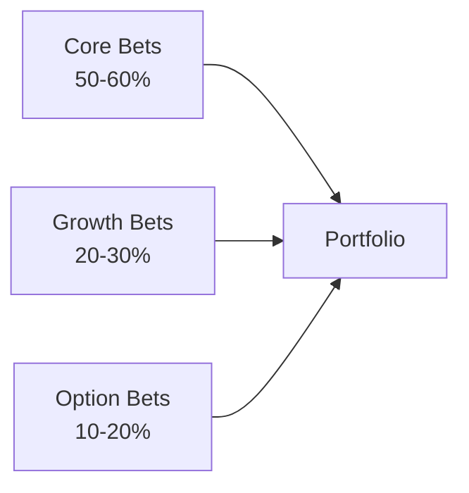

# Executive Leadership 301 — Chapter 4: Capital Allocation

## Why This Chapter Matters
At scale, your main job isn’t to “run projects” — it’s to **decide where the organization’s scarce resources go** and where they don’t.  
Capital allocation is how you shape the future **faster than competitors** while avoiding the trap of overcommitting to low-return bets.

---

## Four Types of Capital You Allocate
1. **Financial Capital** — Budgets, investments, cost controls.
2. **Human Capital** — Headcount, top talent assignments, succession.
3. **Time Capital** — What leaders and teams *spend cycles on*.
4. **Reputation Capital** — Brand trust, political goodwill, partner credibility.

Each has **opportunity cost** — spending in one place means you can’t spend in another.

---

## The Portfolio Mindset
Think like an investor:
- You have a **finite fund** (capital, talent, attention).
- Each investment should have an **expected return**.
- Risk is **managed at the portfolio level** — not every bet will pay off.

---

## The Bet Sizing Model
- **Core bets (50–60%)** — Defend and grow your strongest revenue streams.
- **Growth bets (20–30%)** — Expand into adjacencies with strong upside.
- **Option bets (10–20%)** — Small, experimental projects with big potential.

This prevents “core starvation” while keeping the future alive.

### Portfolio Mix — Visual

---

## Kill Criteria — Your Best Friend
Great allocators **define kill criteria at approval time**, not after months of sunk cost.
- **Metric-based**: If X < target for 2 quarters, stop.
- **Date-based**: If milestone not hit by Q2, stop.
- **Strategic-fit based**: If market changes make bet irrelevant, stop.

Attach kill criteria to the **decision brief** and review at the **MBR**.

---

## The Decision Matrix (Example)
| Investment | Type        | Size | ROI Expectation | Kill Criteria       | DRI       |
|------------|-------------|------|-----------------|---------------------|-----------|
| Project A  | Core        | $$$  | Maintain 25% GM | <20% GM for 2Q      | VP Sales  |
| Project B  | Growth      | $$   | 3x in 3 years   | Miss 2Q adoption    | VP Product|
| Project C  | Option      | $    | Breakthrough AI | No MVP by Dec       | CTO       |

---

## Executive Capital Allocation Cadence
1. **Quarterly portfolio review** — Check distribution between Core/Growth/Options.
2. **Monthly capital shifts** — Small rebalances as bets evolve.
3. **Annual zero-based budgeting** — Every dollar must be justified from zero.
4. **Ad-hoc reallocations** — Triggered by market shifts, crises, or major wins.

---

## Pitfalls to Avoid
- **Pet projects** — Investments survive because of politics, not ROI.
- **Spread too thin** — A dozen small bets instead of 3–5 bold ones.
- **Late kill** — Waiting too long to stop a failing project.
- **Starving the core** — Over-investing in the shiny new while the cash engine weakens.

---

## 90-Minute Capital Allocation Workshop
1. **Portfolio mapping (25m)** — Categorize all current bets into Core/Growth/Options.
2. **ROI scoring (20m)** — Assign expected return and confidence rating.
3. **Kill criteria definition (20m)** — Add explicit stop rules to each bet.
4. **Rebalance (15m)** — Adjust funding/talent to hit ideal distribution.
5. **Communicate (10m)** — Share portfolio changes with stakeholders.

---

## Stage & Context Adaptations
- Startup/Turnaround: Heavier Option/Growth mix initially; time-box experiments; weekly rebalance.
- Scaleup: Protect Core funding; formalize kill criteria; monthly small shifts.
- Enterprise: Zero-based budgeting; rigorous ROI hurdles; governance reviews.
- Regulated: Include compliance risk-weighting; pre-approve stop rules with Legal/Risk.
- Remote/Distributed: Share portfolio in memo; async review, live decision.

## Mini‑Case: Rebalancing to Strength
A scaleup starved its cash engine while funding 12 small bets. By moving to 55% Core, 25% Growth, 20% Options and adding kill criteria, it grew GM by 6 points and freed 15% opex for compounding Core initiatives.

---

## Connects to
- Chapter 6: Decision briefs and RAPID roles for investment approvals
- Chapter 3: MBR as the forum for portfolio review and reallocations
- Chapter 12: KPI trees and dashboards that track ROI and kill triggers

---

## Chapter 4 “Ship It” Checklist
- [ ] Written portfolio map with bet types and sizes
- [ ] ROI expectations and kill criteria for each investment
- [ ] Capital allocation cadence scheduled
- [ ] Core bets sufficiently funded
- [ ] Option bets limited to safe portfolio %
