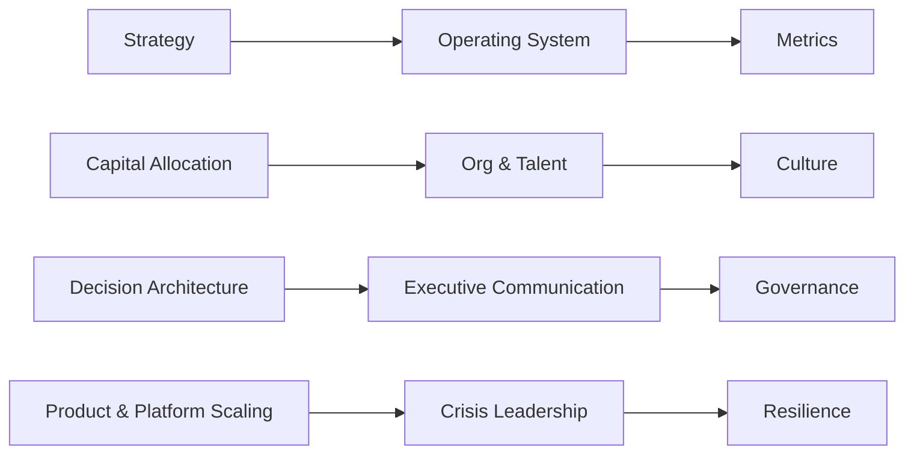

# Executive Leadership 301 — Front Matter

## Table of Contents
- [Front Matter](front-matter.md)
- [Chapter 01: The Executive Shift](chapter-01-the-executive-shift.md)
- [Chapter 02: Strategy & Narrative](chapter-02-strategy-and-narrative.md)
- [Chapter 03: The Operating System](chapter-03-the-operating-system.md)
- [Chapter 04: Capital Allocation](chapter-04-capital-allocation.md)
- [Chapter 05: Org Design & Talent Density](chapter-05-org-design-and-talent-density.md)
- [Chapter 06: Decision Architecture](chapter-06-decision-architecture.md)
- [Chapter 07: Executive Communication](chapter-07-executive-communication.md)
- [Chapter 08: Governance & Stakeholders](chapter-08-governance-and-stakeholders.md)
- [Chapter 09: Culture by Design](chapter-09-culture-by-design.md)
- [Chapter 10: Product & Platform Scaling](chapter-10-product-and-platform-scaling.md)
- [Chapter 11: Crisis Leadership](chapter-11-crisis-leadership.md)
- [Chapter 12: Measuring What Matters](chapter-12-measuring-what-matters.md)
- [Glossary](glossary.md)
- [References](references.md)
- [Back Matter](back-matter.md)

## Who this book is for
- Executives and executive-trajectory leaders who own outcomes across multiple teams or functions.
- Founders, GMs, Chiefs of Staff, VPs, Directors preparing to operate at enterprise scale.

## How to use this book
- Each chapter follows the same pattern: Why it matters → frameworks → workshop → Ship It checklist.
- Start with Chapter 1 to install your executive “operating context,” then pick the chapter that addresses your immediate bottleneck.
- Produce the artifacts as you go. The book is designed to be shipped, not just read.

## Reading paths
- Rapid install (2 weeks): 1 → 3 → 6 → 2 → 4 → 12. Ship the core OS, decision rights, strategy, capital, and metrics.
- Scaling path (3–4 weeks): 1 → 3 → 10 → 5 → 8 → 9 → 11. Focus on scale, org design, governance, culture, and crisis readiness.
- Comprehensive path (6–8 weeks): Read in order, complete all workshops, and adopt the full template pack.

## What you will ship (artifact checklist)
- Executive Charter; Decision Rights Map; Decision Briefs; WBR/MBR agendas and dashboards; Board packet; Stakeholder map; Risk register; Culture doc; Succession plan; Crisis playbook; KPI tree; Dashboard spec.

## 30/60/90 executive install
### 0–30 days (stabilize and clarify)
- Calendar audit across Four Rooms; draft Executive Charter; publish Decision Rights Map; schedule WBR/MBR; select North Star Metric.

### 31–60 days (align and instrument)
- Ship single source of metrics; roll out Decision Briefs; complete portfolio map and kill criteria; perform org/talent audit; draft board packet.

### 61–90 days (scale and compound)
- Rebalance capital; finalize KPI tree; run crisis pre-mortem; tune governance; launch culture rituals; document succession pipelines.

## Notation and terms
- DRI = Directly Responsible Individual (the owner of an outcome).
- Adopt RAPID as the primary decision framework; see Chapter 6 for mapping to DARCI.

## Visual index (Mermaid snippets available inside chapters)
- Four Rooms; Executive OS layers; Portfolio bet sizing; Decision ladder; KPI tree.

Templates are available in the `templates/` directory and linked from the relevant chapters.

## Next
- [Chapter 01: The Executive Shift](chapter-01-the-executive-shift.md)

## How the Chapters Connect (Throughlines)
- Strategy → OS → Metrics: Strategy sets direction; the OS makes it visible; metrics prove progress.
- Capital → Org → Culture: Where you fund shapes structure; structure and rituals shape culture.
- Decisions → Communication → Governance: Clear rights drive crisp messages and board confidence.
- Scaling → Crisis → Resilience: Platform strength and drills reduce incident blast radius and recovery time.

